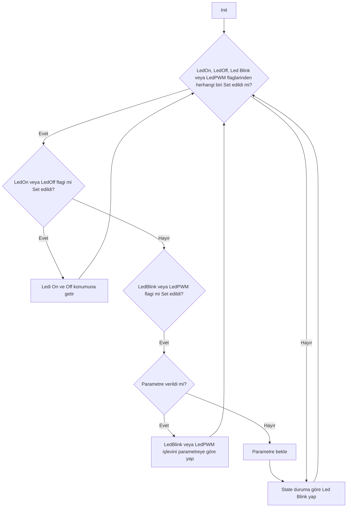
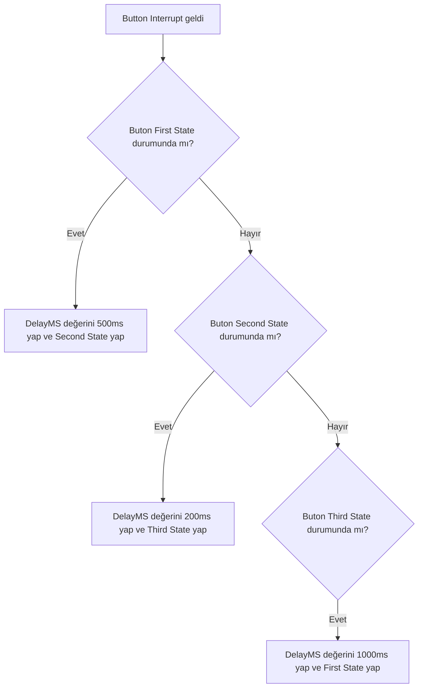

# Tübitak BİLGEM - Proje 1 & 2
State Machine algoritmasına sahip LED uygulaması.

## Genel Yapı

```mermaid
    flowchart TD
    A[Init] --> C{LedOn, LedOff, Led Blink veya LedPWM flaglarinden herhangi biri Set edildi mi?}
    
    C -->|Evet| LedonoffQ{LedOn veya LedOff flagi mi Set edildi?}
    LedonoffQ -->|Evet| LedonoffYes[Ledi On ve Off konumuna getir]
    LedonoffQ -->|Hayır| LedonoffNo{LedBlink veya LedPWM flagi mi Set edildi?}
    LedonoffYes --> C

    LedonoffNo -->|Evet| LedBlinkPWMYes{Parametre verildi mi?}
    LedBlinkPWMYes --> |Evet| LedBlinkPWMYesYes[LedBlink veya LedPWM işlevini parametreye göre yap]
    LedBlinkPWMYes --> |Hayır| LedBlinkPWMYesNo[Parametre bekle]
    LedBlinkPWMYesYes --> C
    LedBlinkPWMYesNo --> LedState

    C --> |Hayır| LedState[State duruma göre Led Blink yap]
    LedState --> C
```

## Button Interrupt

```mermaid
    flowchart TD
    F[Button Interrupt geldi] --> A
    A{Buton First State durumunda mı?} --> |Evet| B[DelayMS değerini 500ms yap ve Second State yap]
    A --> |Hayır| C{Buton Second State durumunda mı?}

    C --> |Evet| D[DelayMS değerini 200ms yap ve Third State yap]
    C --> |Hayır| G{Buton Third State durumunda mı?}

    G --> |Evet| H[DelayMS değerini 1000ms yap ve First State yap]
```
